# Plan Pack Go by "ctrlc ctrlv"

> **Plan smart. Pack right. Go ready.**

**Team:** ctrlc ctrlv

**Team Members:**

- Low Qi Hao
- Lee Jun Yuen
- Yap Soon Chee
- Lee Harold

**Problem Statement:** Travel Planner  
**Track:** Lifestyle & Personal Productivity

**Video Presentation:** [Watch Video Presentation](https://youtu.be/Q974xVcKRQw)

**Presentation Slides:** [Public Slides Link](https://docs.google.com/presentation/d/1dy_Y4mBvRdXbAduXl5Ys8rDBfhlgBOHE/edit?usp=sharing&ouid=100279568698516292267&rtpof=true&sd=true)

# 1. Project Overview

## 1.1 The Problem

Most travel planners help users decide **where to go, when to go, and how much to spend**, but packing is usually handled separately and causing several common problems:

### Problem 1 — Packing Does Not Match Trip Duration

Travellers may underestimate or overestimate how much they need to bring.

**Example:** A 5-day trip is planned, but only 4 sets of clothes are packed.

### Problem 2 — Activity-Specific Items Are Forgotten

Generic packing lists may not reflect planned activities.

**Example:** A beach trip is planned, but sunscreen, sandals, or sunglasses are forgotten.

### Problem 3 — Shared Items Are Poorly Coordinated

Group travellers may duplicate shared items or leave them unassigned.

**Example:** A group needs only one hair dryer, but multiple members each bring their own, causing unnecessary duplication and heavier luggage.

### Problem 4 — Packing Does Not Adapt to Changes

Packing plans may become outdated when activities or weather change.

**Example:** Heavy rain is forecast, but the packing list still does not include an umbrella or raincoat.

**Stakeholders:** Solo travellers, group travellers, and trip organisers.

> **Core problem:** Conventional travel apps know where travellers are going and what they plan to do, but their packing preparation usually does not.

## 1.2 Existing Solutions & Their Limitations

Existing travel planners already provide strong tools for itinerary building, route planning, budgeting, and collaboration.

| Travel Planner   | Strength                                                                               | Remaining Gap                                                                                |
| ---------------- | -------------------------------------------------------------------------------------- | -------------------------------------------------------------------------------------------- |
| **Wanderlog**    | Itinerary planning, route optimisation, budgeting, collaboration and packing checklist | Packing is mainly a checklist and is not deeply generated from each itinerary activity       |
| **Stippl**       | Combines itinerary, budgeting, collaboration and packing in one travel platform        | Limited emphasis on coordinating shared packing responsibilities based on itinerary needs    |
| **Roadtrippers** | Strong route planning, stop discovery, navigation and trip collaboration               | Primarily focused on route and road-trip planning rather than trip preparation and packing   |
| **TripIt**       | Organises reservations, itinerary details and travel logistics                         | Focuses on managing travel information rather than turning the itinerary into a packing plan |

### Identified Gap

Most travel planners help users decide **where to go and how to organise the trip**, but provide limited support for translating the **actual itinerary into an adaptive and coordinated packing plan**.

## 1.3 Our Solution

**Plan Pack Go** is a mobile-first travel planner that supports travellers from initial planning to final trip preparation. Unlike conventional travel planners that stop after the itinerary is created, Plan Pack Go uses the actual itinerary, activities, weather, and trip context to generate an actionable packing plan. For group trips, it further coordinates **shared items**, quantities, responsibilities, and packing progress.

### Travel Planner Basic Functions

- **Itinerary Planning** — organise places, optimise routes, and estimate travel and stay times
- **Budget Tracking** — record major trip expenses
- **Group Preference Sync** — rate and prioritise places together
- **Solo & Group Travel Support** — adapt the experience based on trip type
- **Unexpected Plan Adjustment** — respond to delays, closures, weather, or spontaneous changes

### What Makes Plan Pack Go Different

- **Itinerary-Aware Smart Packing** — packing suggestions are generated from the actual itinerary, weather, and trip context.  
  **Example:** A beach activity is added, so Plan Pack Go suggests sunscreen and sandals.

- **Needed vs Possibly Useful** — separates essential items from optional items.  
  **Example:** Sunscreen may be marked as **Needed**, while sunglasses are **Possibly Useful**.

- **Shared Packing Coordination** — coordinates shared items, quantities, and responsibility.  
  **Example:** A group needs only one hair dryer, so one member claims it instead of everyone bringing their own.

- **Adaptive Packing Updates** — only affected packing suggestions change when the trip changes.  
  **Example:** Heavy rain is forecast, so Plan Pack Go adds rain-related suggestions without resetting the whole packing list.

- **Optional OOTD Planning** — helps travellers plan outfits by day and reuse clothing.  
  **Example:** The same jeans are planned for Day 1 and Day 3, so only one pair needs to be packed.

> **Plan Pack Go connects the final itinerary directly to packing, helping travellers bring the right items, reduce duplication, and stay prepared when plans change.**

# 2. Ideation & Process

## 2.1 Ideas We Considered

| Idea                                     | Decision                          | Why                                                                                        |
| ---------------------------------------- | --------------------------------- | ------------------------------------------------------------------------------------------ |
| **Smart Packing & Luggage Coordination** | **Chosen — Core Differentiator**  | Connects the actual itinerary directly to packing preparation and group coordination.      |
| **Flexible Route Optimisation**          | **Kept — Supporting Feature**     | Useful for itinerary planning, but not unique enough to define the product.                |
| **Group Preference Rating**              | **Kept**                          | Helps groups prioritise places through visible 0–10 ratings.                               |
| **Needed vs Possibly Useful**            | **Kept**                          | Reduces both forgotten essentials and unnecessary overpacking.                             |
| **Personal vs Shared Packing**           | **Kept**                          | Supports group coordination while keeping personal packing private.                        |
| **Suggested Shared Quantity**            | **Kept**                          | Reduces duplicate shared items while allowing user override.                               |
| **Shared Item Assignment / Claiming**    | **Kept**                          | Makes responsibility clear through Unassigned → Assigned/Claimed → Packed states.          |
| **Adaptive Packing Updates**             | **Kept**                          | Updates only affected packing suggestions when itinerary or weather changes.               |
| **OOTD / Outfit Planning**               | **Kept — Optional**               | Helps estimate clothing needs without turning the app into a fashion planner.              |
| **Unexpected Plan Adjustment**           | **Kept — Simplified**             | Covers delays, closures, weather and spontaneous changes without overcomplicating the MVP. |
| **Automatic Full Trip Rescheduling**     | **Dropped / Simplified**          | Too complex and gives users too little control.                                            |
| **Complex Budget Management**            | **Dropped / Simplified**          | Added scope without strengthening the core idea.                                           |
| **Dedicated Food Budget**                | **Dropped**                       | Too detailed for the MVP; food can be recorded as a custom expense.                        |
| **Complex Expense Settlement**           | **Dropped**                       | Would shift the product toward an expense-splitting app.                                   |
| **Health Disruption Handling**           | **Dropped**                       | Added sensitive and unnecessary complexity for the prototype.                              |
| **Complex Member Recalculation**         | **Dropped / Simplified**          | Automatic recalculation of all trip data was too complex for the MVP.                      |
| **Mandatory Destination Setup**          | **Dropped**                       | Would restrict flexible multi-city trip planning.                                          |
| **Mandatory Onboarding**                 | **Dropped**                       | Added friction before users could start planning.                                          |
| **Generic AI Travel Planner**            | **Dropped**                       | AI itinerary generation alone was too common to differentiate the product.                 |
| **Route Optimisation as Core Idea**      | **Dropped as Core Direction**     | Strong supporting feature, but already common in travel planners.                          |
| **Packing-Only App**                     | **Dropped as Product Direction**  | Would not satisfy the full Travel Planner problem statement.                               |
| **Stress & Workload Manager**            | **Dropped — Alternative Problem** | Easier to build, but more crowded and less differentiated than Travel Planner.             |

## 2.2 Ideation Boards

### Ideation Mindmap

The following mindmap shows how our ideas evolved from problem selection into a focused Travel Planner solution. Node colours represent whether an idea was chosen, extended, simplified, dropped, or kept as optional.
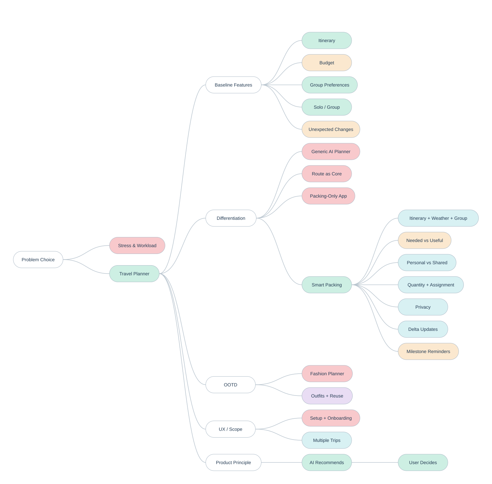

**Colour Legend:** 🟢 Chosen / Kept · 🔵 Extended · 🟠 Simplified · 🔴 Dropped · 🟣 Optional

#### Why Some Ideas Were Dropped

- **Stress & Workload Manager** — a more crowded problem space with less room for strong differentiation.
- **Generic AI Travel Planner** — AI-generated itineraries are already common in existing travel apps.
- **Route Optimisation as the Core Idea** — useful, but already widely available, so it remained only a supporting feature.
- **Packing-Only App** — too narrow and would not satisfy the full Travel Planner problem statement.
- **Dedicated Food Budget** — added unnecessary detail for the MVP.
- **Complex Expense Settlement** — would shift the product toward an expense-splitting app.
- **Fully Automatic Rescheduling** — too complex and would reduce user control over trip changes.
- **Health Disruption Handling** — added sensitive complexity without strengthening the core solution.
- **Mandatory Destination Setup / Onboarding** — added unnecessary steps and reduced flexibility for multi-city trips.

### 5 Whys Analysis

The 5 Whys analysis helped us trace packing problems back to their root cause: **trip planning and packing preparation are disconnected**.

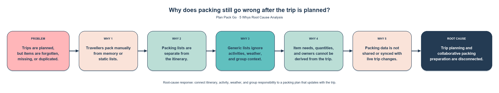

**Root Cause:** Trip planning and collaborative packing preparation are disconnected.

## 2.3 Mentor Consultation

| Date       | Mentor         | Feedback Received                                                                                                                          | What Was Changed                                                                                                                                                                |
| ---------- | -------------- | ------------------------------------------------------------------------------------------------------------------------------------------ | ------------------------------------------------------------------------------------------------------------------------------------------------------------------------------- |
| 10/09/2026 | Kueh Pang Teng | Overall concept was good. Suggested focusing more on documenting the ideation process and using clearer examples in the problem statement. | Added a clearer ideation process using a mindmap and 5 Whys chain, and revised the problem statement with simple examples to make the identified problems easier to understand. |

## 3. Design & Prototype

**UI Prototype:** [Open Interactive Prototype](YOUR_PUBLIC_PROTOTYPE_LINK)

The prototype is designed as a mobile-first travel planner. The selected screens below show how judges can access the prototype, follow the core travel-planning flow, and experience Plan Pack Go's main differentiator: **itinerary-aware Smart Packing and group luggage coordination**.

<table>
<tr>
<td width="50%" align="center">

<h3>1. Login — How to Access</h3>

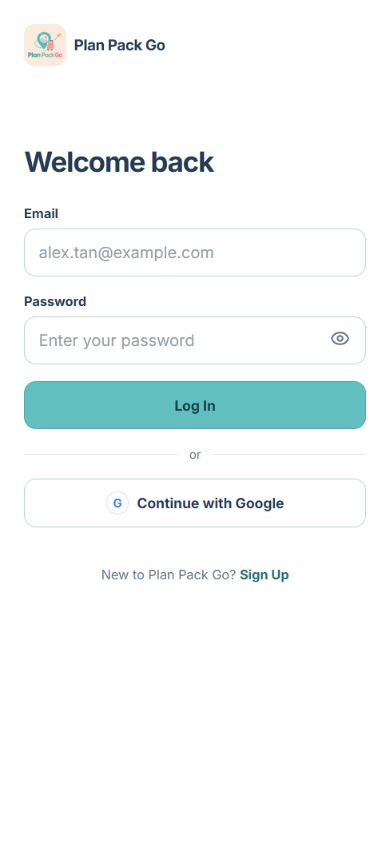

Use <strong>Continue with Google</strong> to enter the interactive prototype — no admin credentials are required.

</td>

<td width="50%" align="center">

<h3>2. My Trips — Start or Resume a Trip</h3>

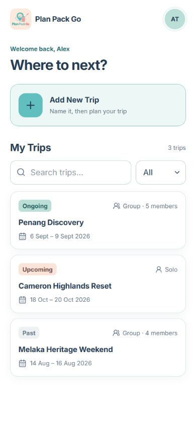

Create a new Solo or Group trip, or reopen an existing trip from one central travel hub.

</td>
</tr>

<tr>
<td width="50%" align="center">

<h3>3. Group Preference Rating — Plan Together</h3>

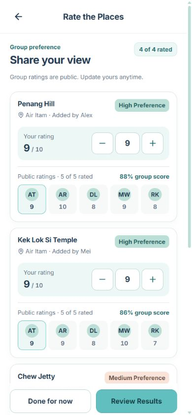

Group members rate shared places from 0–10 so the final plan reflects everyone’s preferences.

</td>

<td width="50%" align="center">

<h3>4. Itinerary Planning — Turn Choices into a Route</h3>

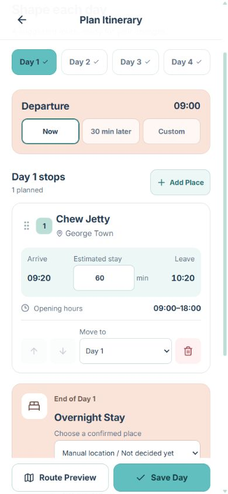

Confirmed places are organised into a multi-day route that users can review and adjust before finalising.

</td>
</tr>

<tr>
<td width="50%" align="center">

<h3>5. AI Packing Suggestions — Pack for the Actual Trip</h3>

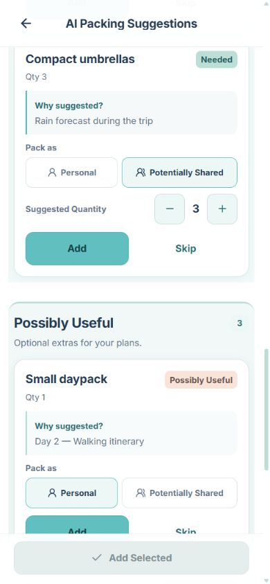

Plan Pack Go turns the actual itinerary and weather into explainable packing suggestions — users choose what to <strong>Add</strong> or <strong>Skip</strong>.

</td>

<td width="50%" align="center">

<h3>6. Shared Packing — Coordinate Group Luggage</h3>

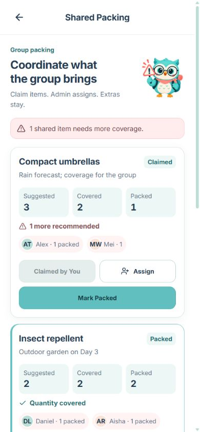

Shared items can be assigned or claimed, with quantity tracking to prevent duplicates, shortages, and forgotten luggage.

</td>
</tr>

<tr>
<td width="50%" align="center">

<h3>7. Budget — Track Trip Costs</h3>

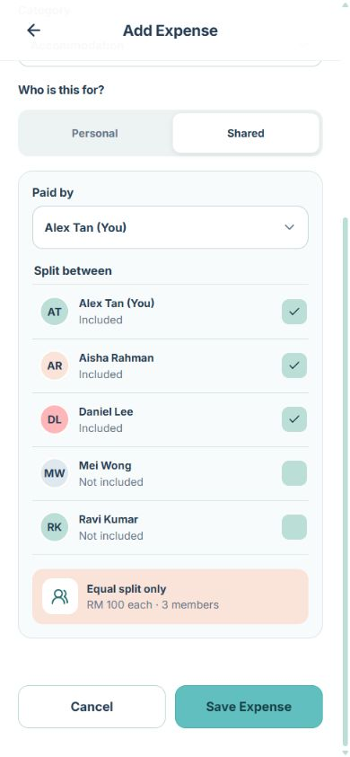

Record personal or shared trip expenses, including who paid and which members share the cost.

</td>

<td width="50%" align="center">

<h3>8. Packing Delta — Adapt When the Trip Changes</h3>

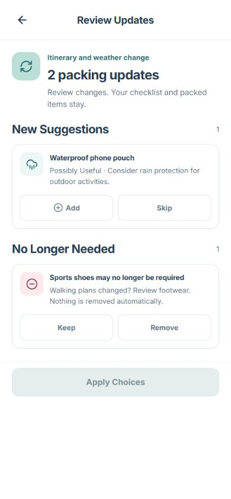

When the itinerary or weather changes, only affected packing suggestions are updated while the existing checklist stays intact.

</td>
</tr>
</table>

# 4. What Makes It Different

Plan Pack Go is not just another itinerary planner or packing checklist. Its key difference is that it connects the **actual itinerary directly to packing preparation and group coordination**.

### Itinerary-Aware Smart Packing

Packing suggestions are generated from the traveller’s actual activities, trip duration, weather, and destination context instead of using a generic checklist.

### Needed vs Possibly Useful

Items are separated into **Needed** and **Possibly Useful**, helping users avoid both underpacking and unnecessary overpacking.

### Shared Packing Coordination

For group trips, shared items are visible to all members and include suggested quantities and clear responsibility through:

**Unassigned → Assigned / Claimed → Packed**

This reduces duplicated items and prevents important shared items from being forgotten.

### Adaptive Packing Updates

When the itinerary or weather changes, Plan Pack Go updates only the affected packing suggestions instead of rebuilding the entire list.

### Packing Privacy for Groups

Personal packing lists remain private, while group members only see packing progress and shared-item responsibilities.

### Optional Outfit Planning

Travellers can organise outfits by day and reuse clothing across multiple days, helping reduce unnecessary clothing while keeping the feature optional.

> **The key twist is simple: the itinerary does not end at “where are we going?” — it becomes the input for deciding “what do we actually need to bring?”**

# 5. Technical Architecture & Feasibility

## 5.1 Proposed Tech Stack

The current prototype is built with **React + Vite using mock data and simulated services**. If selected for the Building Phase, Plan Pack Go will be developed as a **cross-platform mobile application for Android and iOS** using the following stack.

| Layer                           | Technology                                | Why We Chose It                                                                                                                                                    | Cost / Expected Constraints                                                                                                                                               |
| ------------------------------- | ----------------------------------------- | ------------------------------------------------------------------------------------------------------------------------------------------------------------------ | ------------------------------------------------------------------------------------------------------------------------------------------------------------------------- |
| **Mobile Frontend**             | **React Native + Expo**                   | One codebase can support both Android and iOS, while React knowledge from the prototype can be reused. Expo also simplifies mobile builds, testing and deployment. | **Free to start.** Expo's free tier includes limited Android/iOS cloud builds, but builds use a lower-priority queue and larger-scale usage may require a paid plan.      |
| **Backend**                     | **Supabase + Edge Functions**             | Provides backend services in one platform and allows protected server-side logic for AI and external API requests.                                                 | **Free tier suitable for the hackathon.** Free projects have usage limits and may pause after inactivity.                                                                 |
| **Database**                    | **Supabase PostgreSQL**                   | Relational data fits trips, members, itineraries, expenses, ratings and packing items well.                                                                        | Free tier currently includes **500 MB database storage**; larger production usage would require upgrading.                                                                |
| **Authentication**              | **Supabase Auth**                         | Supports email/password and social authentication while integrating directly with the database.                                                                    | Included in Supabase free tier; usage limits apply as the number of active users grows.                                                                                   |
| **Realtime Collaboration**      | **Supabase Realtime**                     | Supports live group ratings, shared packing assignments and trip updates.                                                                                          | Free quota is sufficient for prototype/build testing, but high message volume or concurrent users could exceed limits.                                                    |
| **File Storage**                | **Supabase Storage**                      | Stores profile images and optional OOTD photos without requiring a separate storage provider.                                                                      | Free tier currently includes **1 GB storage**; image compression will be used to reduce usage.                                                                            |
| **Maps & Places**               | **Mapbox Maps + Search / Geocoding APIs** | Provides interactive mobile maps, place search and location data with a generous free tier.                                                                        | Mobile Maps SDK is currently free up to **25,000 MAU**; search/geocoding quotas apply beyond the free allowance.                                                          |
| **Route Optimisation**          | **Mapbox Directions + Optimization API**  | Supports travel-time estimation, route calculation and efficient ordering of multiple stops.                                                                       | Currently free up to **100,000 requests/month** for Directions and Optimization APIs, after which usage becomes paid.                                                     |
| **Weather**                     | **Open-Meteo API**                        | Provides forecast data required for weather-aware itinerary alerts and packing suggestions without needing an API key for prototype use.                           | **Free for non-commercial use**, with rate limits and no uptime guarantee. Commercial deployment would require a paid plan or self-hosting.                               |
| **AI Packing Analysis**         | **Gemini API**                            | Analyses itinerary activities, weather and trip context to generate contextual packing suggestions.                                                                | A **free developer tier** is available, but model/rate limits apply. AI requests will be sent through a backend function so the API key is not exposed in the mobile app. |
| **Notifications**               | **Expo Notifications**                    | Supports packing reminders, group updates and trip alerts across Android and iOS.                                                                                  | Suitable for the hackathon at low cost; notification permissions, device tokens and OS restrictions must be handled correctly.                                            |
| **Prototype Hosting**           | **Vercel**                                | Provides a public link for the current React prototype with automatic deployment from GitHub.                                                                      | **Hobby plan: $0/month**, but intended for personal/non-commercial use and subject to usage limits.                                                                       |
| **Mobile Build & Distribution** | **Expo EAS**                              | Builds Android and iOS apps without maintaining separate native build pipelines.                                                                                   | Expo provides a free build allowance. Public app-store distribution may still require developer registration fees.                                                        |

### Cost Strategy

Our goal is to keep the Building Phase close to **RM0 infrastructure cost** by staying within the free tiers of Supabase, Expo, Mapbox, Open-Meteo, Gemini and Vercel.

The main expected constraints are API rate limits, Supabase free-tier storage/realtime quotas, AI usage limits, and mobile app-store registration fees. API keys and AI requests will be routed through backend functions rather than exposed directly in the mobile application.

## 5.2 System Architecture

The proposed architecture connects the mobile application with Supabase backend services, PostgreSQL storage, and external APIs for maps, weather, AI analysis, and notifications.

The core workflow uses itinerary, trip duration, weather, and group context to generate Smart Packing suggestions while keeping the final decision with the user.

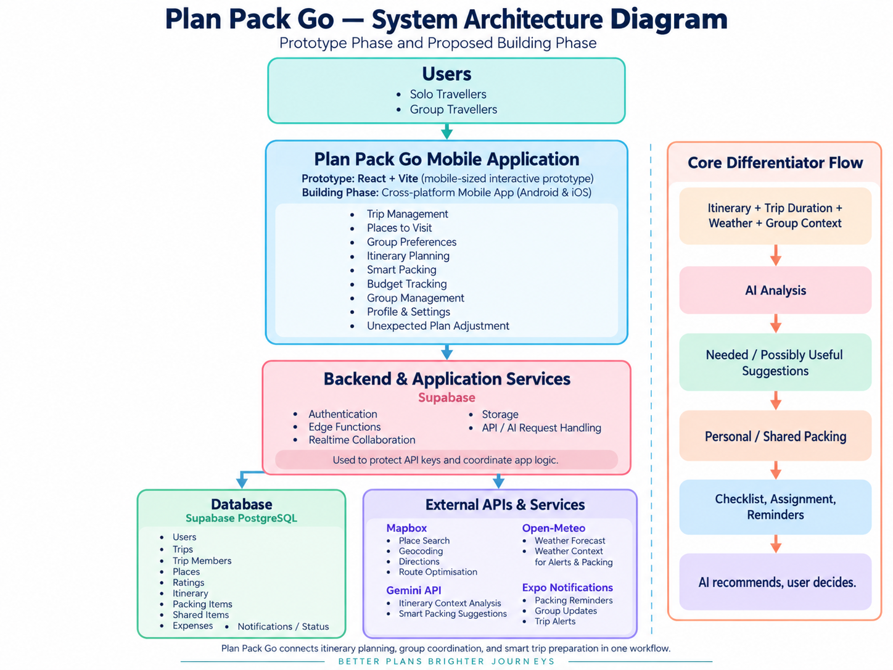

## 5.3 Build Plan & Scope

During the Building Phase, we will convert the current interactive prototype into a functional cross-platform mobile application, focusing first on the complete trip-planning flow and Plan Pack Go's core differentiator.

### Building Phase MVP

We plan to implement:

- **User Authentication**
  - Sign up / login
  - User profile
  - Persistent trip data

- **Trip Management**
  - Create and manage multiple trips
  - Solo / Group trip modes
  - Invite and manage group members

- **Places & Group Preferences**
  - Add places to a shared trip list
  - 0–10 group ratings
  - Aggregate preference results

- **Itinerary Planning**
  - Day-by-day itinerary
  - Place search
  - Route optimisation
  - Travel-time and distance estimates
  - Basic itinerary impact warnings

- **Smart Packing — Core Feature**
  - Analyse itinerary activities, trip duration and weather
  - Generate **Needed / Possibly Useful** suggestions
  - Personal and Shared packing lists
  - Suggested shared-item quantities
  - **Unassigned → Assigned/Claimed → Packed** workflow

- **Adaptive Packing Updates**
  - Detect meaningful itinerary or weather changes
  - Generate only affected packing updates instead of resetting the checklist

- **Budget Tracking**
  - Record trip expenses
  - Basic personal / shared expense tracking

- **Trip Alerts & Reminders**
  - Packing reminders
  - Shared-item alerts
  - Basic weather / itinerary change notifications

### Implementation Priority

1. Core trip and user data
2. Group collaboration
3. Itinerary and map integration
4. Smart Packing and AI integration
5. Shared packing coordination
6. Budget and trip alerts
7. Testing, bug fixing and deployment preparation

### Out of Scope for the Initial Building Phase

To keep the scope realistic, we will not prioritise:

- fully automatic itinerary rescheduling
- complex expense settlement or debt optimisation
- advanced health-related disruption handling
- complex member-impact recalculation
- advanced offline functionality
- extensive AI automation without user confirmation

Optional features such as **OOTD / Outfit Planning** will be treated as stretch goals after the core workflow is stable.

> **Our priority is to deliver one complete and reliable workflow: plan the trip → finalise the itinerary → generate the packing plan → coordinate shared items → get ready to go.**
