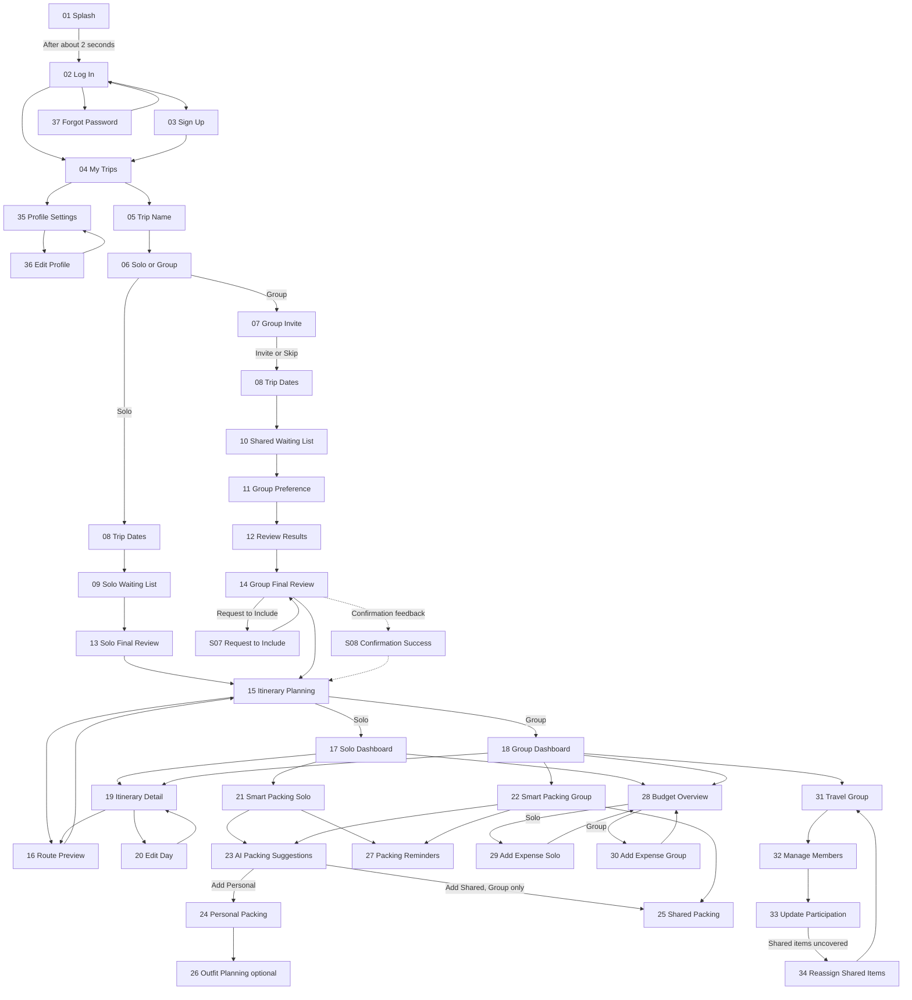
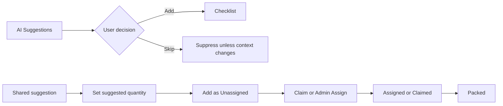
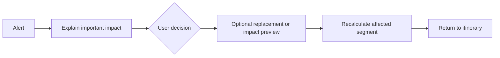

# Plan Pack Go — User Flow

## Readable primary flow

### Entry

`01 Splash` → after approximately two seconds → `02 Log In`

- Log In → `04 My Trips`
- Sign Up link → `03 Sign Up` → `04 My Trips`
- Forgot Password → `37 Forgot Password` → `02 Log In`
- Profile icon from My Trips → `35 Profile Settings` → `36 Edit Profile`

### Create Trip

`04 My Trips` → `05 Trip Name` → `06 Solo or Group`

**Solo:** `08 Trip Dates` → `09 Solo Waiting List` → `13 Solo Final Review` → `15 Itinerary Planning` → `17 Solo Dashboard`

**Group:** `07 Group Invite` (or Skip for now) → `08 Trip Dates` → `10 Shared Waiting List` → `11 Group Preference` → `12 Review Results` → `14 Group Final Review` → `15 Itinerary Planning` → `18 Group Dashboard`

From `14 Group Final Review`, `Request to Include` opens `S07 Request to Include` and returns to `14` after the public vote/review. Confirming final places may show `S08 Confirmation Success` before continuing to `15 Itinerary Planning`.

Solo never enters Group-only screens. Group functions are not merely disabled for Solo; they are hidden and the layout reflows.

For every day that continues into another night, Itinerary Planning ends at an Overnight Stay anchor. The final departure day requires no accommodation when the traveller returns home; it ends at `Return home` / `Trip ends` instead.

### Dashboard modules

- Itinerary → `19 Itinerary Detail` → `16 Route Preview` or `20 Edit Day`.
- Smart Packing → `21 Smart Packing Solo` or `22 Smart Packing Group`.
- Budget → `28 Budget Overview` → `29 Add Expense Solo` or `30 Add Expense Group`.
- Group (Group only) → `31 Travel Group` → `32 Manage Members` → `33 Update Participation`; uncovered shared items may open `34 Reassign Shared Items`.

Meaningful saved actions may briefly use the reusable `S08 Confirmation Success` pattern, then return to their documented parent or next destination. S08 is feedback, not a standalone module.

Back returns to the immediate parent without discarding saved data. Cancel closes the current modal/edit state and restores the previous screen. Device/system back must match the visible Back/Cancel result.

## Smart Packing flows

**Solo:** Smart Packing Solo → AI Suggestions → Add/Skip → Personal Packing.

**Group:** Smart Packing Group → AI Suggestions → choose Personal/Potentially Shared → Add/Skip → Personal Packing or Shared Packing. Other members expose only count/percentage progress.

`Packing Reminders` is a secondary entry on both Smart Packing home screens (21 and 22), not an action inside Personal Packing.

**Shared state:** Suggestion → Shared → Suggested Quantity → Add → Unassigned → Claim/Admin Assign → Assigned/Claimed → Packed.

**Delta update:** Itinerary/weather change → `S06 Packing Delta` → user chooses Add/Keep/Remove/Skip → preserve earlier checklist and packed decisions.

## Unexpected change flow

Alert (`S01`, `S02` or `S03`) → limited user decision → replacement/impact preview when relevant (`S04` or `S05`) → recalculate affected route/times → return to `19 Itinerary Detail`.

The system explains important consequences but does not make the final choice.

## Mermaid flowchart

## Mermaid subflows

## Asynchronous Group rule

Members may add and rate at different times. New places can become Unrated after some members have already finished. `Done for now` is not a permanent lock; Review Results shows participation so the Admin can decide when to continue.
